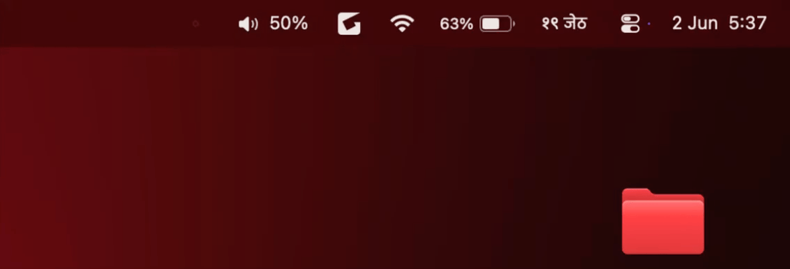

# 🔊 VolumeScroller

A minimal macOS menu bar app that lets you control system volume by scrolling over the icon — the way it should have always worked.

  


## Features

- **Scroll** over the menu bar icon to adjust volume (3% per step) ; **works perfectly with extenal mouse**
- **Click** the icon for a slider popover
- **Right-click** to mute/unmute, toggle launch at login, or quit
- Minimal — no Dock icon, no background processes beyond what's needed
- Free, no subscriptions, no App Store


## Preview 
ß

<p align="center">
  
</p>

## Install

### One-liner (recommended)

Open Terminal

```bash
curl -sL https://raw.githubusercontent.com/sujoff/VolumeScroll/main/install.sh | bash
```

Ignore x-code related warning unless its an error, app will be installed and visible in menu bar now. Enjoy !!

### Manual
1. Clone or download this repo
2. Run:
```bash
chmod +x install.sh && ./install.sh
```

That's it. The script builds from source and installs to `/Applications`.

## First Launch

macOS will prompt for **Accessibility permission** — this is required to detect scroll events over the menu bar.

Go to **System Settings → Privacy & Security → Accessibility** and enable VolumeScroll.

## Requirements

- macOS 13 (Ventura) or later
- Apple Silicon Mac (M1 and above)
- Xcode Command Line Tools (`xcode-select --install`)

## Usage

| Action | Result |
|---|---|
| Scroll up on icon | Volume +3% |
| Scroll down on icon | Volume −3% |
| Left click icon | Open volume slider |
| Right click icon | Menu (mute, login, quit) |

## Build from source

```bash
git clone https://github.com/YOUR_USERNAME/VolumeScroll
cd VolumeScroll
./build.sh
open VolumeScroll.app
```

## License

MIT
